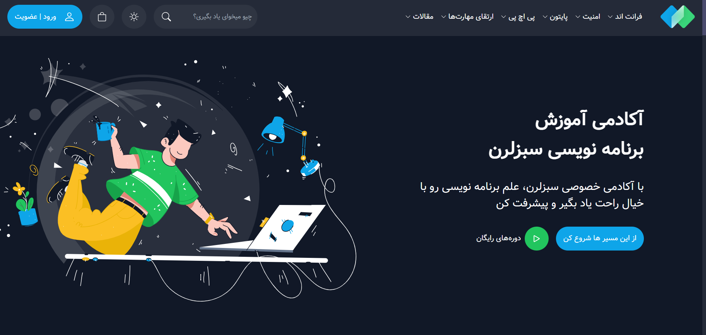

# SabzLearn Sample Project

This is a sample portfolio project for **SabzLearn** (an online educational platform) designed to showcase web development skills. This project is hosted on GitHub and is fully responsive, created with a focus on a seamless user experience across various devices. Future updates are planned to introduce a **Light Mode** to enhance usability.

## Live Demo

Check out the live version of this project [https://mehrangholami1384.github.io/sabzlearn/](https://mehrangholami1384.github.io/sabzlearn).

[](https://mehrangholami1384.github.io/sabzlearn/)

Experience the responsive design, interactive elements, and smooth navigation firsthand through the live demo.

## Technologies Used

This project is built with a combination of modern web technologies:

- **HTML**: For structuring content and creating accessible layouts.
- **CSS**: For styling and enhancing the visual aesthetics of the project.
- **Bootstrap**: Utilized for responsive design, grid system, and pre-built components.
- **JavaScript**: For adding interactive elements and functionalities.
- **jQuery**: Integrated to simplify DOM manipulation, animations, and event handling.

## Features

- **Fully Responsive Design**: Adapts smoothly across different screen sizes, from desktops to mobile devices, ensuring a consistent user experience.
- **Interactive UI**: Animations and transitions are implemented to create an engaging, user-friendly interface.
- **Easy Navigation**: An intuitive layout for quick access to all sections, with a clear structure.
- **Future Light Mode**: A light mode feature is planned for upcoming versions, allowing users to switch between dark and light themes.

## Project Structure

The project's folder structure is organized as follows:

- `index.html`: Main HTML file that structures the home page and links to other pages.
- `css/`: Contains all custom and Bootstrap CSS files.
- `js/`: Holds JavaScript and jQuery files for interactive functionalities.
- `img/`: Directory for images used in the project.

## Getting Started

Follow these steps to run the project locally:

1. Clone the repository:
   ```bash
   git clone https://github.com/MehranGholami1384/sabzlearn.git

2. **Download through this link** :
     [Download the Project](https://github.com/MehranGholami1384/sabzlearn/archive/refs/heads/main.zip)
